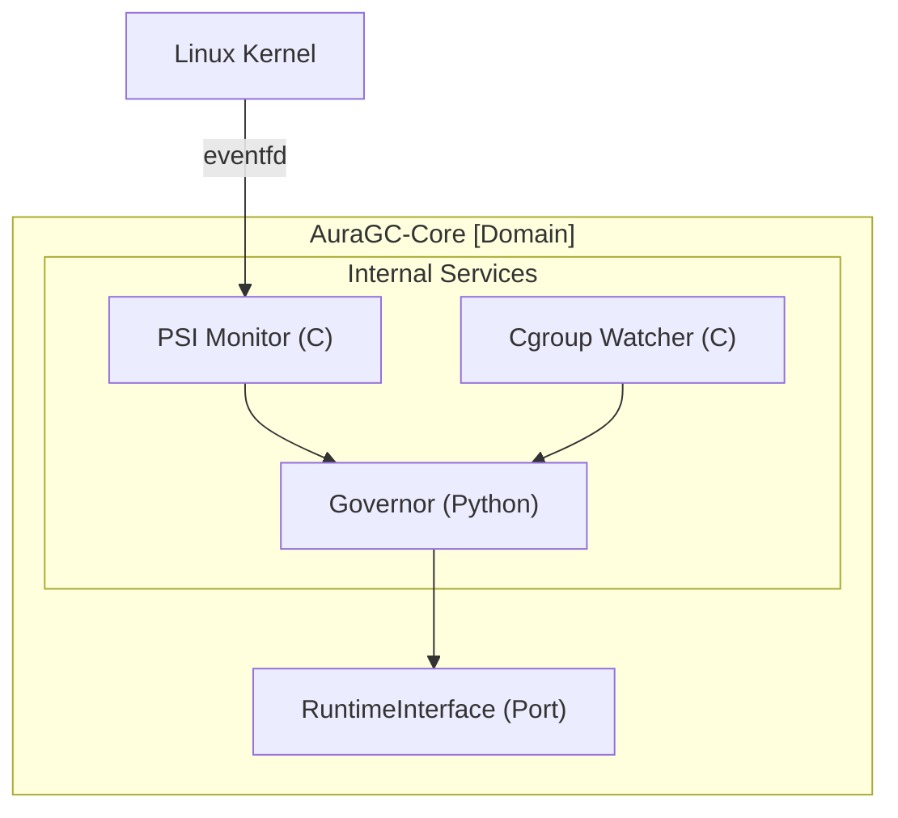
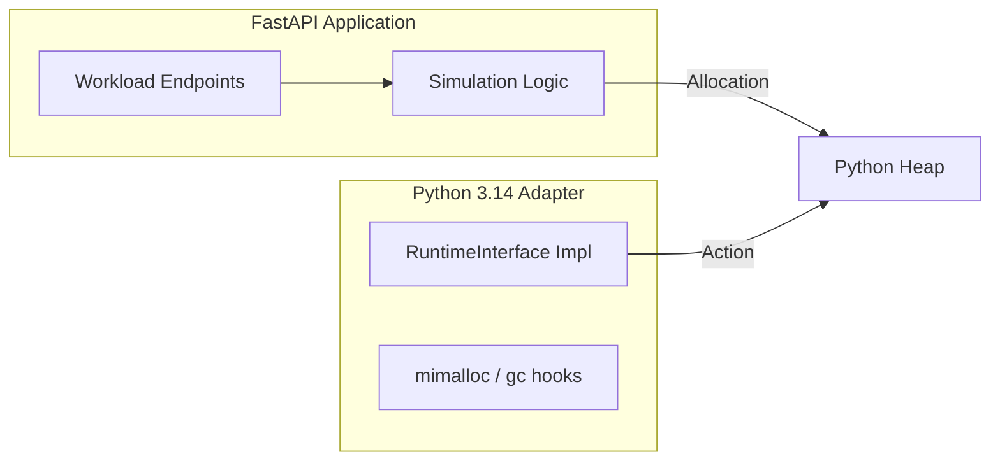

This document provides the complete technical specification for **AuraGC**, a high-performance, hexagonal, 3-tiered garbage collection orchestrator specifically designed for **Python 3.14 (Free-threading)**.

---

# AuraGC: Project Specification & Development Roadmap

AuraGC is split into two independent projects to ensure the core sensing logic is decoupled from the runtime-specific implementation.

## Project A: `auragc-core` (The Domain)

**Goal:** Monitor system-level memory pressure (PSI/Cgroups) and decide *when* and *how* to collect garbage.

### 1. Architecture (Hexagonal)

The Core uses **Inbound Adapters** to sense the environment and an **Outbound Port** to command any language runtime.



### 2. Tech Stack

* **Core Logic:** Python 3.14 (Math/Strategy).
* **Sensors:** C11 (Low-latency file polling via `poll()` and `eventfd`).
* **Interface:** `abc.ABC` for defining the Runtime Port.

### 3. Key Implementation: `core/ports.py`

```python
from abc import ABC, abstractmethod

class RuntimeInterface(ABC):
    @abstractmethod
    def get_heap_stats(self) -> dict:
        """Returns blocks, objects, and generation counts."""
        pass

    @abstractmethod
    def collect(self, generation: int):
        """Triggers GC for a specific generation."""
        pass

    @abstractmethod
    def freeze(self):
        """Freezes currently alive objects."""
        pass

```

---

## Project B: `auragc-sample-app` (FastAPI + Adapter)

**Goal:** Implement the bridge for Python 3.14 and provide a simulation environment for the hackathon demo.

### 1. Architecture (Tiered Implementation)

Project B acts as a consumer of Project A, implementing the `RuntimeInterface` and wrapping it in a web service.



### 2. Tech Stack

* **Framework:** FastAPI (Async/AuraGC integration).
* **Runtime:** Python 3.14t (Free-threaded).
* **Diagnostic:** Memray (Memory profiling).

### 3. Key Implementation: `adapter/python_adapter.py`

```python
import gc
import sys
from auragc.core.ports import RuntimeInterface

class Python314Adapter(RuntimeInterface):
    def get_heap_stats(self):
        return {
            "allocated_blocks": sys.getallocatedblocks(),
            "gen_counts": gc.get_count()
        }

    def collect(self, generation: int):
        return gc.collect(generation)

    def freeze(self):
        gc.collect() # Clean cycles before freezing
        gc.freeze()

```

---

## 4-Hour Development Strategy (Hackathon Sprint)

### Hour 1: The Foundation (Core Sensors)

* **Task:** Implement `native_psi.c` in Project A.
* **Goal:** Use C to poll `/proc/pressure/memory`. If "some" pressure > 10ms, signal the Python layer.
* **Why:** Demonstrates 7th-year engineering depth in systems programming.

### Hour 2: The Hexagon (Governor & Port)

* **Task:** Write the `Governor` in Project A.
* **Goal:** Map PSI signals to GC strategies (e.g., `PSI_HIGH` -> `collect(2)`).
* **Why:** Establishes the architectural pattern (Hexagonal) and ensures future portability.

### Hour 3: The Bridge (Adapter & API)

* **Task:** Implement `Python314Adapter` and FastAPI endpoints in Project B.
* **Goal:** Create `/simulate/leak` (circular refs) and `/simulate/static` (long-lived objects).
* **Why:** Prepares the live demo environment.

### Hour 4: Integration & Benchmark

* **Task:** Run Project B with `auragc-core` enabled.
* **Goal:** Use **Memray** to generate two charts.
* **Chart 1:** Standard Python hitting Cgroup limit (Crash).
* **Chart 2:** AuraGC maintaining 80% memory usage by proactive collection.


* **Why:** Visual proof of performance is the most critical factor for winning a hackathon.

---

## Final Project Structure

```text
.
├── auragc-core/                 # Project A (The Intelligence)
│   ├── src/native_psi.c         # C-based kernel sensor
│   ├── auragc/core/governor.py  # Decision logic
│   └── auragc/core/ports.py     # Hexagonal interfaces
│
└── auragc-sample-app/           # Project B (The Simulation)
    ├── app/main.py              # FastAPI endpoints
    ├── app/adapter.py           # Python 3.14 Bridge
    └── tests/benchmark.py       # Stress test script

```

**Would you like me to generate the `native_psi.c` code to handle the C-level kernel polling now?**