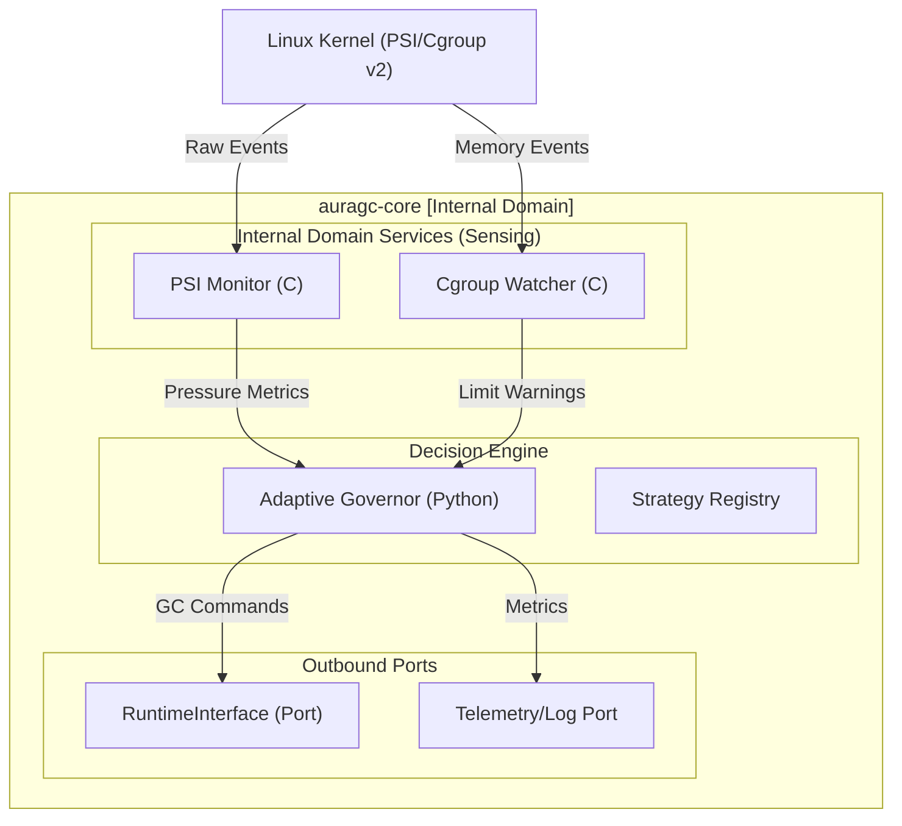

## Project A: `auragc-core` Planning Document

**Project A** is the "Intelligence Layer" of the AuraGC ecosystem. It is a standalone, high-performance sensing and decision-making engine. Its primary responsibility is to monitor the operating system's memory pressure and determine the optimal garbage collection strategy without being tied to a specific language runtime.

---

### 1. Architecture: Hexagonal Domain Core

The core logic is isolated from infrastructure details. It uses **Inbound Adapters** (Internal Domain Services) to gather telemetry and an **Outbound Port** (Contract) to send commands to any runtime adapter.



---

### 2. Tech Stack

| Layer | Component | Technology | Rationale |
| --- | --- | --- | --- |
| **Native Tier** | **Memory Sensors** | **C11** | Low-level access to `/proc/pressure/memory` and `epoll` for zero-latency monitoring. |
| **Logic Tier** | **Governor** | **Python 3.14** | Fast iteration for complex heuristic algorithms and PID-controller logic. |
| **Glue Layer** | **C-Bindings** | **`ctypes` / `cffi**` | Lightweight bridge between the C sensors and the Python Governor. |
| **Contract** | **Interfaces** | **`abc.ABC`** | Strict Hexagonal "Ports" to ensure Project B (Adapter) is strictly decoupled. |

---

### 3. Key Components Detail

#### **A. Internal Domain Service: PSI Monitor (C)**

A background native thread that monitors Linux **Pressure Stall Information**.

* **Mechanism:** Opens `/proc/pressure/memory` and uses `select()` or `epoll()` on the file descriptor.
* **Trigger:** Signals the Governor when `some` or `full` pressure exceeds the 10ms-20ms window.
* **Output:** A "Pressure Index" (0.0 to 1.0).

#### **B. Internal Domain Service: Cgroup Watcher (C)**

Monitors cgroup v2 memory events to prevent OOM kills in containerized (K8s) environments.

* **Mechanism:** Watches `memory.events` for `high`, `max`, or `oom` entries.
* **Output:** Immediate "Critical" signal to the Governor.

#### **C. Decision Engine: Adaptive Governor (Python)**

The brain that maps environmental signals to a **GC Strategy**.

* **Strategies:**
* **`AGGRESSIVE`**: Trigger Gen 2 collection (Full GC) immediately.
* **`PREEMPTIVE`**: Trigger Gen 0/1 collection to clear short-lived objects.
* **`SILENT`**: Suppress GC to prioritize CPU throughput (Peak Traffic mode).
* **`FREEZE`**: Finalize "Immortal" objects to reduce future scan overhead.


---

### 4. Port Definition: `RuntimeInterface`

This is the abstract contract that **Project B** must implement.

```python
from abc import ABC, abstractmethod

class RuntimeInterface(ABC):
    @abstractmethod
    def get_heap_usage(self) -> dict:
        """
        Retrieves current memory metrics from the target runtime.
        Expected: { 'allocated_blocks': int, 'gen_counts': tuple }
        """
        pass

    @abstractmethod
    def trigger_gc(self, generation: int) -> int:
        """Triggers collection for the specified generation and returns objects freed."""
        pass

    @abstractmethod
    def apply_freeze(self):
        """Signals the runtime to brand current objects as immortal."""
        pass

```

---

### 5. Structure Strategy (The Files)

```text
auragc-core/
├── src/
│   ├── native_psi.c      # C11: PSI Polling logic
│   ├── native_cgroup.c   # C11: Cgroup event logic
│   └── common.h          # Shared C headers
├── auragc/
│   ├── core/
│   │   ├── __init__.py
│   │   ├── governor.py   # Decision logic & Strategy Registry
│   │   └── sensors.py    # Python wrapper for C-extensions
│   └── interfaces/
│       └── runtime.py    # The Port: RuntimeInterface
└── setup.py              # Compiles C extensions & packages the core

```

---

### 6. Development Priorities (4-Hour Window)

1. **Phase 1 (Native):** Implement the C-based PSI sensor. It must be able to run in a separate thread without blocking the Python interpreter.
2. **Phase 2 (Logic):** Implement the `Governor` that consumes sensor data. Focus on the `UrgencyScore` calculation.
3. **Phase 4 (Port):** Formalize the `RuntimeInterface` to be consumed by Project B.

**Would you like to see the planning docs for Project B (The FastAPI Adapter) next, or should I dive deeper into the C sensor implementation for Project A?**