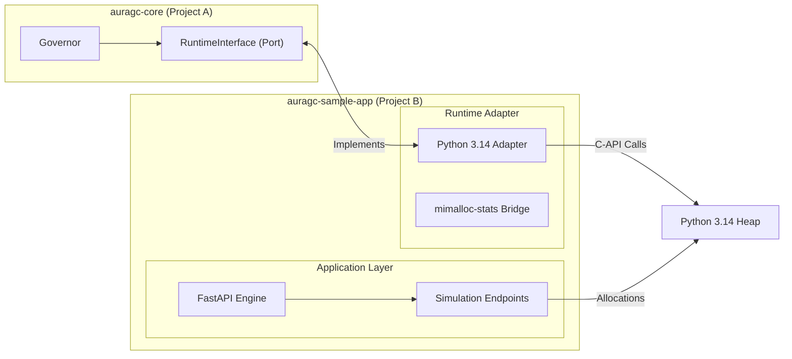

## Project B: `auragc-sample-app` Planning Document

**Project B** is the "Execution Layer" and "Simulation Environment." It serves as the concrete implementation of the AuraGC ecosystem for **Python 3.14 (Free-threading)**. It contains the specialized **Runtime Adapter** that bridges the Core's intelligence to the actual Python heap and a **FastAPI** application to simulate real-world production workloads.

---

### 1. Architecture: Tiered Implementation & Simulation

Project B acts as a consumer of Project A. It implements the `RuntimeInterface` (the Port) and exposes it to the `Governor`.



---

### 2. Tech Stack

| Layer | Component | Technology | Rationale |
| --- | --- | --- | --- |
| **Framework** | **Web Engine** | **FastAPI** | Async-first, high-performance framework to handle concurrent simulation requests. |
| **Runtime** | **Target Engine** | **Python 3.14t** | The experimental Free-threaded build where GC performance is most critical. |
| **Interface** | **Dependency** | **`auragc-core`** | Imported as a local dependency to implement the `RuntimeInterface`. |
| **Instrumentation** | **Bridge** | **`ctypes` / `gc**` | Direct interaction with Python's internal GC and memory stats. |
| **Workload** | **Simulators** | **`numpy` / `bytearray**` | Used to create specific memory patterns (Leaks, Cycles, Static Data). |

---

### 3. Key Components Detail

#### **A. Python 3.14 Runtime Adapter**

The concrete implementation of the Outbound Port from Project A.

* **Heap Sensing:** Uses `sys.getallocatedblocks()` and `gc.get_count()` to report telemetry back to the Core.
* **GC Action:** Wraps `gc.collect(n)` to execute specific generation-level collections requested by the Core.
* **Immortal Branding:** Implements `gc.freeze()` to lock objects into the permanent generation.

#### **B. Simulation Endpoints (FastAPI)**

Specialized endpoints to trigger different memory scenarios for benchmarking:

* **`/allocate/ephemeral`**: Creates 10,000+ short-lived strings (simulates high-frequency API objects).
* **`/allocate/cyclic`**: Creates objects with circular references (simulates memory leaks that standard RC cannot catch).
* **`/allocate/static`**: Pre-loads large lookup tables (simulates objects that should be "frozen" by AuraGC).
* **`/stats`**: Returns the current view of the heap, used by Project C (Visualizer).

#### **C. Dependency Injection & Wiring**

The application "self-registers" during startup.

* On `startup`, the `Python314Adapter` is instantiated.
* The `auragc-core` Governor is initialized with this adapter.
* The Governor's background thread (C-based PSI sensor) is launched.

---

### 4. Structure Strategy (The Files)

```text
auragc-sample-app/
├── app/
│   ├── __init__.py
│   ├── main.py          # FastAPI startup and wiring logic
│   ├── adapter.py       # Implementation of RuntimeInterface for 3.14
│   ├── workloads.py     # Logic for simulating leaks and spikes
│   └── telemetry.py     # Prometheus/JSON metrics exporter
├── requirements.txt     # Includes fastapi, uvicorn, and ../auragc-core
└── run_sim.sh           # Script to start uvicorn with 3.14t

```

---

### 5. Development Priorities (4-Hour Window)

1. **Phase 1 (The Bridge):** Implement the `Python314Adapter`. Ensure it can correctly trigger `gc.collect()` and report `sys.getallocatedblocks()`.
2. **Phase 2 (FastAPI):** Set up the FastAPI skeleton and the `/allocate/cyclic` endpoint. This is the primary target for testing the PSI sensor's effectiveness.
3. **Phase 3 (Integration):** Import `auragc-core` and verify that a memory spike in FastAPI triggers the native C-thread in the Core, which then calls back into the Adapter to clear the heap.

---

### 6. The "Golden" Test Scenario

The success of Project B is defined by its ability to survive a "Leak Storm":

* A client floods `/allocate/cyclic` with a 1GB limit.
* **Standard Python:** Process hangs or dies as it hits the Cgroup limit.
* **AuraGC (Project B):** The adapter intercepts the pressure signal and clears the cycles before the OS kills the process.

**Would you like to see the planning docs for Project C (The Visualizer/Testing Suite) next?**