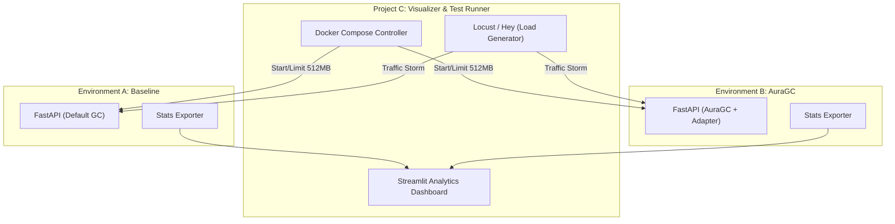

## Project C: `auragc-visualizer` Planning Document

**Project C** is the "Validation and Analytics Layer." It provides the empirical framework required to prove the effectiveness of AuraGC. It operates as an external observer, running controlled experiments to compare the AuraGC-enabled runtime against the standard Python 3.14 garbage collector under identical stress conditions.

---

### 1. Architecture: The Comparative Observability Suite

Project C uses a "Side-by-Side" (A/B) testing architecture. It manages two isolated environments and uses a centralized controller to inject load and aggregate metrics.



---

### 2. Tech Stack

| Category | Technology | Rationale |
| --- | --- | --- |
| **Orchestration** | **Docker Compose** | Ensures strict resource isolation (CPU/Memory limits) to simulate K8s cgroup constraints. |
| **Load Testing** | **Locust** | Python-based distributed load testing to simulate complex user behavior and memory spikes. |
| **Visualization** | **Streamlit** | Rapid development of interactive, real-time data dashboards. |
| **Data Analysis** | **Pandas / Plotly** | For calculating and graphing Tail Latency (P95/P99) and Memory RSS deltas. |
| **Profiling** | **Memray** | To capture and compare heap snapshots and flame graphs during the "Leak Storm." |

---

### 3. Key Components Detail

#### **A. The Comparison Orchestrator**

A configuration-driven runner that ensures both environments are identical except for the GC mechanism.

* **Constraint Enforcement:** Both containers are limited using `mem_limit: 512mb` and `cpus: 1.0` to ensure the PSI (Pressure Stall Information) sensors in the AuraGC Core have a clear threshold to detect.
* **Warm-up Sync:** Ensures both apps have completed their "Immortal Branding" phase before the load test begins.

#### **B. The Traffic Simulator (Locust)**

A script designed to stress the memory management specifically:

* **Scenario 1 (The Leak):** Repeatedly calls `/allocate/cyclic` to create unreferenced loops.
* **Scenario 2 (The Spike):** Generates bursts of 10,000+ small object allocations to test Gen 0/1 frequency.
* **Scenario 3 (Steady State):** Simulates a constant background load to measure CPU overhead of the C-based PSI thread.

#### **C. The AuraGC Dashboard**

A real-time Streamlit interface displaying:

* **Memory RSS (Resident Set Size):** A live line chart showing how close each process is to the 512MB limit.
* **GC Execution Counts:** Counters showing the frequency of Gen 0, 1, and 2 collections.
* **Process Health:** A status indicator showing if the "Default GC" container has been killed by the OOM (Out of Memory) Killer.

---

### 4. Structure Strategy (The Files)

```text
auragc-visualizer/
├── infra/
│   └── docker-compose.yaml   # Defines the Baseline and AuraGC services
├── scripts/
│   ├── locustfile.py         # Load generation scenarios
│   └── collect_profiles.sh   # Automated Memray snapshot trigger
├── dashboard/
│   └── app.py                # Streamlit visualization code
├── Makefile                  # Commands to 'make test' and 'make dashboard'
└── results/                  # Directory for generated reports and charts

```

---

### 5. Development Priorities (4-Hour Window)

1. **Phase 1 (Infrastructure):** Set up the `docker-compose.yaml`. This is critical to ensure that the PSI sensors in Project A actually have "Pressure" to detect within the container.
2. **Phase 2 (Load Script):** Write the Locust file. Focus on the cyclic reference leak, as this most clearly demonstrates the difference between reactive and proactive collection.
3. **Phase 3 (Dashboard):** Build the Streamlit dashboard. The most important visual is the **Memory Usage vs. Time** chart comparing the two processes.

---

### 6. The "Success Metric" for Project C

The visualizer project is successful if it can clearly display the **"Memory Plateau"**:

* **The Default GC** line should climb steadily until the process disappears (OOM).
* **The AuraGC** line should climb, hit the PSI threshold, dip sharply (collection), and then stabilize in a "sawtooth" pattern safely below the container limit.

---

**This concludes the planning phase for the three projects (A, B, and C). You now have a complete architectural blueprint for a hybrid C/Python GC system. Which part of the implementation would you like to see first?**